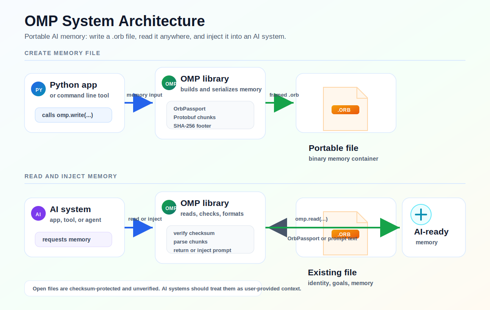

# Orbynt Memory Protocol (OMP)

[](#orb-files)
[](#trust-and-safety)
[](https://www.python.org/)
[](https://pypi.org/project/orbynt-protocol/)
[](#license)

OMP is a portable memory passport for AI.

It lets a user save identity, preferences, goals, values, skills, interests,
relationships, and memories into one `.orb` file. That file can be read by
another AI system, app, tool, or library.

Simple idea:

```text
User memory -> .orb file -> another AI system
```

## What Is OMP?

OMP is an open Python library and binary file format for AI memory.

A `.orb` file is like a small memory suitcase. It can carry useful context such
as:

- who the user is
- how the user wants answers
- what the user is trying to do
- what the user cares about
- what the user knows
- important facts, notes, projects, and experiences

Without OMP, every AI system starts from zero. With OMP, a user can bring
structured memory with them.

## Why OMP Is Useful

OMP is useful because AI memory should be portable, readable, and structured.

Developers can use OMP to:

- create `.orb` memory files with Python
- read `.orb` files back into apps
- turn memory into AI prompt text
- search memory records locally
- export memory to JSON or Markdown
- access bundled protobuf schemas
- build tools around one shared memory format

## System Diagram

This is the high-level flow:



Inside the file:

```text
.orb
|-- Header
|   |-- magic bytes: ORB1
|   |-- protocol version
|   |-- flags
|   `-- chunk table
|
|-- Chunks
|   |-- protocol metadata
|   |-- identity
|   |-- profile
|   |-- preferences
|   |-- goals
|   |-- values
|   |-- skills
|   |-- interests
|   |-- relationships
|   |-- memories
|   |-- graph
|   |-- provenance
|   `-- export policy
|
`-- Footer
    |-- total file length
    |-- SHA-256 checksum
    `-- footer magic: ORBF
```

## Install

```bash
pip install omp
```

## Quick Start

```python
import omp

omp.write(
    "user_memory.orb",
    identity={"display_name": "User"},
    preferences={"communication.style": "clear and simple"},
    goals=[{"title": "Learn AI tools"}],
    values=[{"statement": "Build useful things"}],
    memories=[
        {
            "memory_type": "fact",
            "summary": "The user is learning OMP",
            "full_content": "The user wants to create portable AI memory files.",
            "tags": ["omp", "ai", "memory"],
            "importance": 1.0,
        }
    ],
)

passport = omp.read("user_memory.orb")
print(passport.identity.display_name)
print(passport.memories[0].summary)
```

That creates a real `.orb` file.

## Full Example

```python
import omp

passport = omp.write(
    "complete_memory.orb",
    identity={
        "display_name": "User",
        "username": "user",
        "primary_language": "English",
        "timezone": "UTC",
    },
    profile={
        "biography": "A person building with AI tools.",
        "occupation": "Builder",
        "organization": "Independent",
        "website_links": ["https://example.com"],
    },
    preferences={
        "communication.style": "concise but complete",
        "formatting": "markdown",
        "technical_depth": "high",
    },
    goals=[
        {
            "title": "Build a memory tool",
            "description": "Create a useful AI memory workflow.",
            "priority": "high",
            "status": "active",
        }
    ],
    values=[
        {
            "statement": "Build ethically",
            "priority": "high",
            "category": "work",
        }
    ],
    skills=[
        {
            "name": "Python",
            "description": "Writing scripts and tools",
            "level": "intermediate",
            "years_experience": 2,
        }
    ],
    interests=[
        {"name": "AI", "description": "Practical AI systems"},
        {"name": "Protocols", "description": "Portable data formats"},
    ],
    relationships=[
        {
            "person_name": "Team",
            "relationship_type": "collaborator",
            "notes": "People working on the same project.",
        }
    ],
    memories=[
        {
            "memory_type": "project",
            "summary": "The user is testing OMP",
            "full_content": "The user is creating a .orb file and reading it back.",
            "tags": ["project", "omp"],
            "confidence": 1.0,
            "importance": 0.9,
        }
    ],
    compress=True,
)
```

## What Is Stored In A Passport?

OMP stores memory in a clean passport structure:

```text
OrbPassport
1. Protocol Metadata
2. Identity
3. Profile
4. Preferences
5. Goals
6. Values
7. Skills
8. Interests
9. Relationships
10. Memories
11. Memory Graph
12. Embeddings
13. Adapters
14. Provenance
15. Export Policy
16. Integrity Metadata
```

In simple words:

- Identity means who the user is.
- Preferences means how the AI should respond.
- Goals means what the user wants to achieve.
- Values means what matters to the user.
- Skills means what the user can do.
- Interests means topics the user cares about.
- Relationships means important people, groups, or roles.
- Memories means facts, notes, projects, and experiences.
- Provenance means where information came from.
- Integrity Metadata means checksum and file integrity information.

## Memory Types

Each memory has a `memory_type`.

```text
fact
goal
preference
value
skill
interest
relationship
event
project
note
conversation
episodic
```

## Memory Record Fields

Each memory is saved as a `MemoryRecord`:

```text
memory_id
memory_type
summary
full_content
namespace_id
tags
confidence
importance
created_at
updated_at
provenance
related_memory_ids
embedding_refs
graph_node_refs
custom_attributes
```

## Read A `.orb` File

```python
import omp

passport = omp.read("complete_memory.orb")

print(passport.protocol_metadata.protocol_name)
print(passport.identity.display_name)

for memory in passport.memories:
    print(memory.memory_type, memory.summary)
```

Open `.orb` files always read as:

```python
passport.verified  # False
passport.tier      # "open"
```

## Turn Memory Into An AI Prompt

```python
import omp

passport = omp.read("complete_memory.orb")

generic_prompt = omp.inject(passport)
openai_prompt = omp.inject(passport, target="openai")
anthropic_prompt = omp.inject(passport, target="anthropic")
gemini_prompt = omp.inject(passport, target="gemini")
```

The generated prompt includes a trust block saying the memory is open and
unverified.

## Search Memories

```python
import omp

passport = omp.read("complete_memory.orb")

matches = omp.query(
    passport,
    text="AI memory",
    kind="project",
    tags=["omp"],
    limit=5,
    min_confidence=0.7,
)

for match in matches:
    print(match.score, match.memory.summary)
```

The query engine runs locally. No server is required.

## Export Memory

```python
import omp

passport = omp.read("complete_memory.orb")

data = omp.export(passport, format="dict")
json_text = omp.export(passport, format="json")
markdown_text = omp.export(passport, format="markdown")

omp.export(passport, format="json", path="memory.json")
omp.export(passport, format="markdown", path="memory.md")
```

## Merge Memory Files

```python
import omp

old_passport = omp.read("old.orb")
new_passport = omp.read("new.orb")

merged = omp.merge(old_passport, new_passport, strategy="latest")
omp.write("merged.orb", passport=merged)
```

Merge strategies:

- `latest`
- `union`
- `source_a`
- `source_b`

## Inspect A File

```python
import omp

omp.inspect("complete_memory.orb")
```

## Verify A File

```bash
omp verify complete_memory.orb
```

Open `.orb` files use checksum verification. They do not include issuer
signatures.

## Proto Files

OMP includes all protobuf schema files.

List proto files:

```python
import omp

print(omp.list_proto_files())
```

Read one proto file:

```python
memory_proto = omp.get_proto_source("memory.proto")
passport_proto = omp.get_proto_source("passport")
```

Get all proto files:

```python
all_sources = omp.get_all_proto_sources()
```

Get one schema text block:

```python
bundle = omp.get_proto_bundle()
```

Get an AI-friendly schema block:

```python
context = omp.get_ai_schema_context()
```

Export all proto files to one text file:

```python
omp.export_proto_bundle("omp-protos.txt")
```

Import generated protobuf modules:

```python
from omp.proto import memory_pb2, passport_pb2

memory = memory_pb2.MemoryRecord()
memory.summary = "Created directly with protobuf"

passport = passport_pb2.OrbPassport()
passport.memories.append(memory)
```

Proto namespace:

```proto
package orbynt.memory.protocol.v1;
```

## Public Python API

### `omp.write(path, ...)`

Creates a `.orb` file and returns the generated passport object.

Common inputs:

- `identity`
- `profile`
- `preferences`
- `goals`
- `values`
- `skills`
- `interests`
- `relationships`
- `memories`
- `adapters`
- `provenance`
- `export_policy`
- `compress`
- `version`

### `omp.read(path)`

Reads a `.orb` file.

### `omp.inject(passport, target="generic")`

Turns a passport into prompt text.

Targets:

- `generic`
- `openai`
- `anthropic`
- `claude`
- `gemini`

### `omp.query(passport, ...)`

Searches memories.

Inputs:

- `text`
- `kind`
- `tags`
- `limit`
- `min_confidence`

### `omp.inspect(path)`

Prints a readable summary.

### `omp.merge(passport_a, passport_b, strategy="latest")`

Combines two passports.

### `omp.export(passport, format, path=None)`

Exports to:

- `dict`
- `json`
- `markdown`

### `omp.list_proto_files()`

Lists bundled `.proto` files.

### `omp.get_proto_source(name)`

Returns one `.proto` file.

### `omp.get_all_proto_sources()`

Returns all `.proto` files.

### `omp.get_proto_bundle()`

Returns all `.proto` files as one text bundle.

### `omp.get_ai_schema_context()`

Returns schema text that can be given to an AI system.

### `omp.export_proto_bundle(path)`

Writes the proto bundle to a file.

### Constants

```python
omp.__version__
omp.PROTOCOL_VERSION
```

### Exceptions

```python
omp.OMPError
omp.InvalidOrbFile
omp.VersionMismatch
omp.UnsupportedFeature
```

## CLI

Create:

```bash
omp write --name "User" --out memory.orb \
  --memory "kind:fact|summary:Learning OMP|tags:ai,memory" \
  --pref "communication.style=simple"
```

Read:

```bash
omp read memory.orb
omp read memory.orb --format json
omp read memory.orb --format markdown --out memory.md
```

Inspect:

```bash
omp inspect memory.orb
```

Query:

```bash
omp query memory.orb --text "memory" --limit 5
```

Merge:

```bash
omp merge a.orb b.orb --out merged.orb --strategy latest
```

Export:

```bash
omp export memory.orb --format json --out memory.json
```

Verify:

```bash
omp verify memory.orb
```

Proto:

```bash
omp proto list
omp proto show memory
omp proto bundle --out omp-protos.txt
```

Version:

```bash
omp version
```

## `.orb` Files

A `.orb` file is a binary container, not a raw protobuf dump.

The header identifies the file and lists the chunks. The chunks hold the
passport data. The footer stores the file length and SHA-256 checksum so a
reader can detect corruption.

## Trust And Safety

Current `.orb` files are open and unverified.

That means:

- anyone can create them
- anyone can read them
- checksum validation can detect file corruption
- there is no encryption
- there is no issuer signature
- the file does not prove who created it

AI systems should treat open `.orb` files as user-provided context.

## Package Info

Package name:

```text
omp
```

Install:

```bash
pip install omp
```

Import:

```python
import omp
```

File extension:

```text
.orb
```

MIME type:

```text
application/x-omp-memory
```

## Tags

```text
ai
memory
protocol
llm
passport
portable-memory
protobuf
binary-format
open-protocol
orb
```

## License

Apache-2.0.
